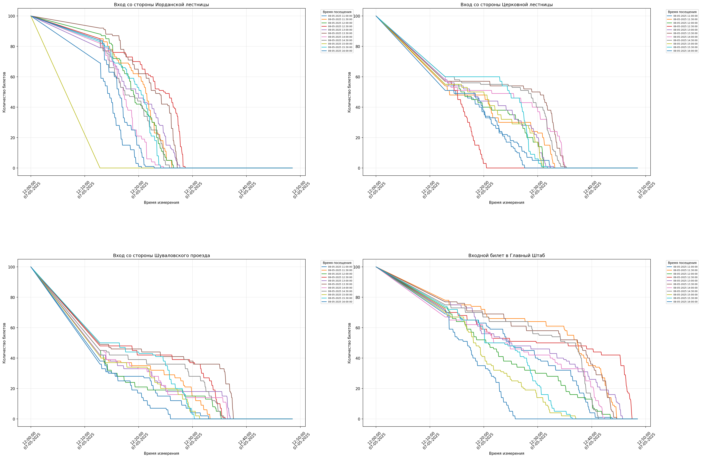

# Ticker

Ticket tracker for free events at [hermitage museum][hermitage]

<p align="center">
    
</p>

## Dependencies

To run the app create a conda environment and install necessary dependencies:

```sh
conda create -n ticker python=3.12
conda activate ticker
pip install click requests python-telegram-bot pandas matplotlib
```

## Running

Parse logs from the [raw measurements file](assets/log.jsonl), save dataframe to [a csv file](assets/log.csv):

```sh
python -m ticker parse-logs -t 5
```

Visualize results and save plot to [a png file](assets/plot.png):

```sh
python -m ticker visualize
```

## Additional options

To disable insecure HTTPS warnings:

```sh
export PYTHONWARNINGS="ignore:Unverified HTTPS request"
```

[hermitage]: https://tickets.hermitagemuseum.org
